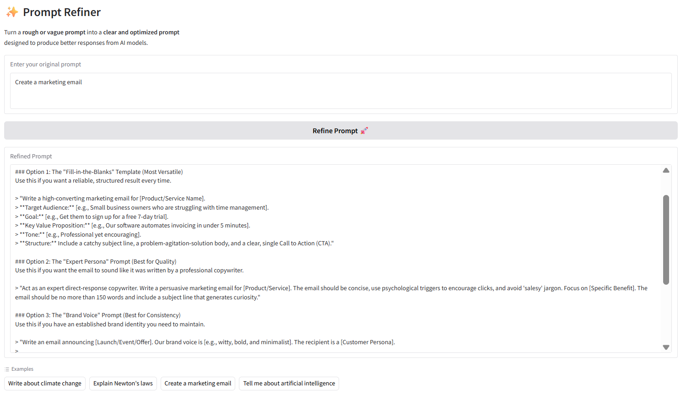

# 🚀 Prompt Refiner – AI Prompt Optimization Tool

## 🎯 Live Demo

👉 **Try it here:** https://huggingface.co/spaces/karn-keshav/prompt-refiner

---

## ✨ Overview

**Prompt Refiner** is an AI-powered web tool that transforms **vague or basic prompts** into **clear, structured, and optimized prompts** for better responses from large language models.

It applies **prompt engineering techniques automatically**, helping users get higher-quality outputs without manually refining prompts.

---

##  Features

- 🔹 Convert simple prompts into high-quality prompts  
- 🔹 Improve clarity, structure, and specificity  
- 🔹 Maintain original tone and intent  
- 🔹 Interactive UI with real-time refinement  
- 🔹 Preloaded examples for quick testing  
- 🔹 Lightweight and easy to run locally  

---

## 🖼️ Preview

---

## ⚙️ Tech Stack

- **Python**
- **Gradio**
- **Google Gemini API**
- **python-dotenv**

---

## 🚀 Getting Started

### 1️. Clone the Repository
### 2️. Install Dependencies
### 3️. Create a .env file and add API key
### 4️. Run the App

---

## 💡 Use Cases
- Learning prompt engineering
- Improving prompts before sending to AI models
- Experimenting with prompt optimization
- Understanding how prompt structure affects outputs

